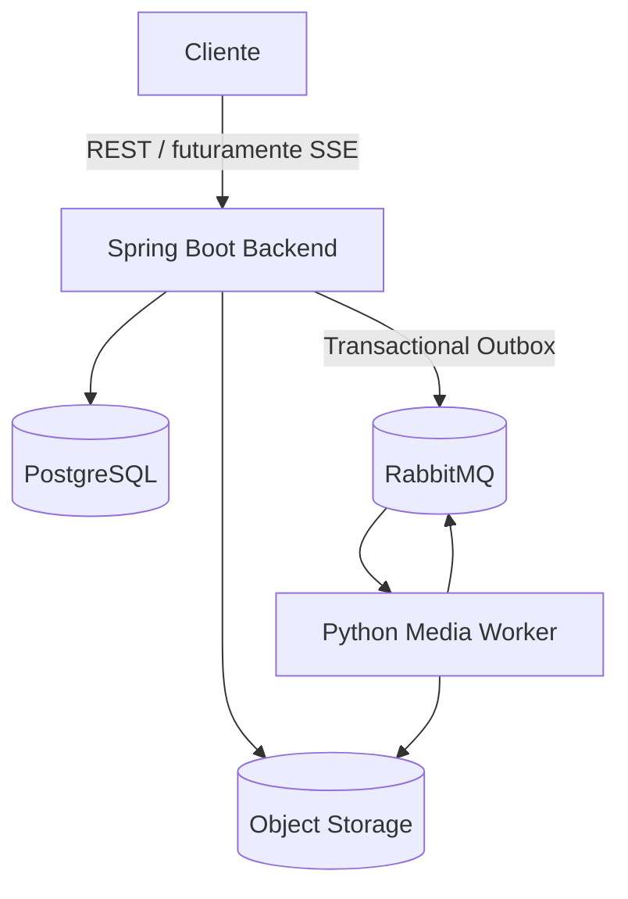

# Clipador

Sistema inteligente para transformar vídeos longos em clipes curtos coerentes, relevantes e prontos para Shorts, TikTok e Reels. O produto combina transcrição, sinais multimodais, análise semântica, seleção não redundante, legendas e reenquadramento — sem reduzir o problema a cortes de duração fixa.

## Estado atual

**Fases 1 a 9 concluídas:** fundação, ingestão segura, pipeline assíncrono confiável, transcrição local, inteligência de seleção, renderização, smart reframing, hardening/observabilidade e interface web operacional.

O endpoint YouTube valida e normaliza a URL, registra o job de forma idempotente e executa `yt-dlp` fora da thread HTTP. Após transcrever e selecionar trechos, o worker cria para cada corte um título curto e fiel à transcrição, renderiza H.264/AAC em 9:16, 16:9 e/ou 1:1, gera SRT/VTT/ASS, aplica burn-in opcional e extrai thumbnail representativa. O título aparece na interface, pode ser copiado diretamente na prévia para publicação e dá nome ao MP4 baixado. Em mudanças de proporção, OpenCV detecta rostos/pessoas e movimento; o FFmpeg aplica uma trajetória de crop interpolada e suavizada. Cada formato falha isoladamente e o backend conclui o job com sucesso parcial quando existe pelo menos um clipe válido.

## Arquitetura



O backend Java é a fonte da verdade e detém as regras de negócio. O Python é um worker especializado em mídia/IA. A descrição completa, limites e estratégia de confiabilidade estão em [docs/architecture.md](docs/architecture.md).

## Stack

- Java 25 LTS, Spring Boot 4.1.1, Maven;
- Spring MVC, Data JPA/Hibernate, Validation, Security, Actuator e AMQP;
- PostgreSQL 18 e Flyway;
- RabbitMQ 4.3.5 com Erlang/OTP 27.3;
- springdoc/OpenAPI 3.0.3;
- Micrometer + Prometheus;
- Testcontainers 2.0.5, JUnit 5, AssertJ e Mockito;
- yt-dlp 2026.08.19 com checksum fixado e FFmpeg/ffprobe mantido pela distribuição da imagem;
- Python 3.13, FastAPI 0.141.1, Pydantic 2.13.4, Pika 1.4.4 e pytest 9.1.1;
- faster-whisper 1.2.1/CTranslate2, Silero VAD e PyAV 18.1;
- análise local de áudio PCM, amostragem visual via FFmpeg e OpenCV headless 4.14 para detecção/tracking local.
- React 19, TypeScript 6, Vite 8, Lucide e Vitest para a interface web local.

## Estrutura

```text
clipador/
├── backend/                  # API, domínio, persistência e orquestração
├── media-worker/             # consumer RabbitMQ, inbox e capacidades de mídia
├── frontend/                 # interface React/TypeScript, testes e build estático
├── infra/                    # configurações operacionais auxiliares
├── docs/
│   ├── adr/                  # decisões arquiteturais
│   ├── architecture.md
│   ├── data-model.md
│   └── pipeline.md
├── compose.yaml
├── .env.example
└── pom.xml                   # build agregador
```

O Compose permanece na raiz por ergonomia: `docker compose up` funciona sem indicar outro arquivo. O monorepo evita versionamento e contratos dispersos no estágio inicial.

## Modelo de dados

O schema contém `app_user`, `video`, `processing_job`, `transcript`, `transcript_segment`, `clip_candidate`, `clip`, `processing_event`, `outbox_message` e `inbox_message`. Binários nunca entram no PostgreSQL. Constraints validam origem, tempos, dimensões, scores, status e progresso; índices atendem os principais caminhos de consulta e polling.

Veja o diagrama em [docs/data-model.md](docs/data-model.md) e a migration executável em `backend/src/main/resources/db/migration`.

## Pipeline

```text
RECEIVED → DOWNLOADING → DOWNLOADED → EXTRACTING_AUDIO
→ TRANSCRIBING → TRANSCRIBED → ANALYZING → ANALYZED
→ SELECTING_CLIPS → GENERATING_CLIPS → GENERATING_SUBTITLES
→ RENDERING → COMPLETED
```

Estados ativos podem ir para `FAILED` ou `CANCELLED`; `FAILED → RECEIVED` é o único retry. Cada transição é validada no domínio e terá evento persistido. O pipeline detalhado, score configurável e estratégia de diversidade estão em [docs/pipeline.md](docs/pipeline.md).

## Como executar

### Execução local nativa (recomendada neste estágio)

O Clipador não depende de Docker. Nesta máquina, PostgreSQL 18 usa um cluster isolado do projeto na porta `55432`; RabbitMQ/Erlang e yt-dlp ficam em `tools/` e não alteram o `PATH` do Windows. Com PostgreSQL 18 e uma build completa de FFmpeg/ffprobe já disponíveis, o bootstrap é:

```powershell
& .\media-worker\.venv\Scripts\python.exe .\infra\local\download_portable_tools.py
.\infra\local\Initialize-LocalEnvironment.ps1
.\infra\local\Test-Prerequisites.ps1
.\infra\local\Start-Clipador.ps1 -OpenBrowser
```

Depois da primeira configuração, também é possível dar dois cliques em `INICIAR-CLIPADOR.cmd`. Backend, worker e frontend ficam ocultos, com logs em `data/logs/apps`, e permanecem ativos após fechar a janela do inicializador. Para desligar tudo, use `PARAR-CLIPADOR.cmd` ou `.\infra\local\Stop-Clipador.ps1`.

`Initialize-LocalEnvironment.ps1` cria `.env.local` com segredos aleatórios, inicializa PostgreSQL e RabbitMQ e pode ser repetido com segurança. O guia completo, incluindo execução manual para depuração, está em [docs/local-development.md](docs/local-development.md).

### Pré-requisitos para Compose

- JDK 25;
- Maven 3.9+;
- Docker com Compose v2 para o ambiente completo.

### Ambiente com containers

No PowerShell:

```powershell
Copy-Item .env.example .env
# Troque todos os valores "replace-with-a-local-password" no .env.
docker compose up --build
```

Serviços:

- API: `http://localhost:8080`
- Interface web: `http://localhost:5173`
- Swagger UI: `http://localhost:8080/swagger-ui.html`
- Health: `http://localhost:8080/actuator/health`
- Prometheus metrics: `http://localhost:8080/actuator/prometheus`
- RabbitMQ Management: `http://localhost:15672`
- Media worker health: `http://localhost:8090/health`
- Media worker metrics: `http://localhost:8090/metrics`

O backend da imagem inclui `yt-dlp`, FFmpeg e ffprobe. O `media-worker` inclui FFmpeg, escreve áudio/transcrição de modo atômico no storage compartilhado e mantém inbox e cache de modelos em volumes separados. No primeiro uso, faster-whisper baixa o modelo configurado; isso consome rede e disco, mas não uma API paga.

### Backend fora do container (comandos manuais)

Suba PostgreSQL/RabbitMQ e exporte as variáveis obrigatórias:

```powershell
$env:SPRING_DATASOURCE_PASSWORD = "sua-senha-local"
$env:SPRING_RABBITMQ_USERNAME = "clipador"
$env:SPRING_RABBITMQ_PASSWORD = "sua-senha-local"
$env:CLIPADOR_SECURITY_USERNAME = "admin"
$env:CLIPADOR_SECURITY_PASSWORD = "sua-senha-local"
mvn -pl backend spring-boot:run
```

Nesse modo, `yt-dlp` e `ffprobe` também precisam estar no `PATH`, ou seus executáveis devem ser informados por variáveis de ambiente.

Flyway aplica migrations na inicialização; Hibernate usa `ddl-auto=validate`, portanto nunca altera o schema silenciosamente.

## Configuração principal

| Variável | Obrigatória | Descrição |
|---|---:|---|
| `SPRING_DATASOURCE_URL` | não | default local `jdbc:postgresql://localhost:5432/clipador` |
| `SPRING_DATASOURCE_USERNAME` | não | default `clipador` |
| `SPRING_DATASOURCE_PASSWORD` | sim | senha PostgreSQL |
| `SPRING_RABBITMQ_HOST` | não | default `localhost` |
| `SPRING_RABBITMQ_USERNAME` | sim | usuário RabbitMQ |
| `SPRING_RABBITMQ_PASSWORD` | sim | senha RabbitMQ |
| `CLIPADOR_SECURITY_USERNAME` | sim | usuário Basic do MVP |
| `CLIPADOR_SECURITY_PASSWORD` | sim | senha Basic do MVP |
| `CLIPADOR_API_DOCS_PUBLIC` | não | libera Swagger/OpenAPI sem autenticação; use `false` em produção |
| `CLIPADOR_MAX_CONCURRENT_REQUESTS` | não | limite por instância, default 64 |
| `CLIPADOR_MAX_CONCURRENT_UPLOADS` | não | uploads simultâneos por instância, default 2 |
| `CLIPADOR_QUEUE_METRICS_INTERVAL` | não | frequência de leitura das filas, default `PT15S` |
| `CLIPADOR_STORAGE_ROOT` | não | diretório local de artefatos |
| `CLIPADOR_STORAGE_TYPE` | não | implementação de storage, atualmente `local` |
| `CLIPADOR_MAX_UPLOAD_BYTES` | não | limite efetivo de upload/download, default 5 GiB |
| `CLIPADOR_MAX_VIDEO_DURATION` | não | duração ISO-8601, default `PT4H` |
| `CLIPADOR_MAX_VIDEO_WIDTH` / `HEIGHT` | não | resolução máxima, default 3840×2160 |
| `CLIPADOR_YT_DLP_EXECUTABLE` | não | caminho do yt-dlp, default `yt-dlp` |
| `CLIPADOR_FFPROBE_EXECUTABLE` | não | caminho do ffprobe, default `ffprobe` |
| `CLIPADOR_ORPHAN_RETENTION` | não | retenção antes de limpar órfãos, default `PT24H` |
| `CLIPADOR_RABBIT_RETRY_DELAY_MS` | não | atraso das filas de retry, default 30000 ms |
| `CLIPADOR_WORKER_MAX_RETRIES` | não | tentativas transitórias antes da DLQ, default 5 |
| `CLIPADOR_WORKER_TASKS` | não | capacidades consumidas por uma instância do worker |
| `CLIPADOR_WHISPER_MODEL` | não | modelo local, default `small` |
| `CLIPADOR_WHISPER_DEVICE` | não | `cpu` ou `cuda`, default `cpu` |
| `CLIPADOR_WHISPER_COMPUTE_TYPE` | não | quantização, default CPU `int8` |
| `CLIPADOR_WHISPER_BEAM_SIZE` | não | beam search, default 5 |
| `CLIPADOR_WHISPER_VAD_MIN_SILENCE_MS` | não | silêncio mínimo do VAD, default 500 ms |
| `CLIPADOR_TRANSCRIPT_MAX_ARTIFACT_BYTES` | não | limite do JSON intermediário, default 64 MiB |
| `CLIPADOR_CLIP_BASE_COUNT` / `MINUTES_PER_CLIP` | não | modo automático: mínimo 5 e mais um corte a cada 5 minutos |
| `CLIPADOR_CLIP_AUTO_MAX` | não | teto do modo automático, default 20 |
| `CLIPADOR_CLIP_EXTENDED_MULTIPLIER` / `EXTENDED_MIN_EXTRA` | não | modo Mais opções: 1,5× e pelo menos 3 extras |
| `CLIPADOR_CLIP_MAX_REQUESTED` | não | máximo aceito no modo manual e ampliado, default 30 |
| `CLIPADOR_CLIP_MIN_DURATION` / `IDEAL_DURATION` / `MAX_DURATION` | não | limites 20/45/90 s |
| `CLIPADOR_SCORE_*_WEIGHT` | não | pesos dos sinais semântica/áudio/vídeo/narrativa/hook/contexto |
| `CLIPADOR_SELECTION_OVERLAP_THRESHOLD` | não | sobreposição máxima aceita, default 0,40 |
| `CLIPADOR_SELECTION_SIMILARITY_THRESHOLD` | não | similaridade textual máxima, default 0,72 |
| `CLIPADOR_ANALYSIS_PROVIDER` | não | `local` (default) ou `ollama` |
| `CLIPADOR_OLLAMA_URL` / `MODEL` | somente com Ollama | endpoint local loopback e modelo já instalado |
| `CLIPADOR_RENDER_FORMATS` | não | lista entre `VERTICAL_9_16`, `LANDSCAPE_16_9`, `SQUARE_1_1` |
| `CLIPADOR_RENDER_BURN_IN_SUBTITLES` | não | incorpora legenda ASS estilizada, default `true` |
| `CLIPADOR_RENDER_VIDEO_CRF` / `PRESET` | não | qualidade e velocidade H.264, defaults 21/medium |
| `CLIPADOR_RENDER_MAX_OUTPUT_BYTES` | não | limite por MP4 renderizado, default 2 GiB |
| `CLIPADOR_SMART_REFRAMING_ENABLED` | não | ativa detecção e crop dinâmico, default `true` |
| `CLIPADOR_REFRAMING_MODE` | não | `AUTO`, `FOCUS`, `GROUP` ou `BLURRED_BACKGROUND` |
| `CLIPADOR_REFRAMING_SAMPLE_FPS` | não | amostras visuais por segundo, default 1,5 |
| `CLIPADOR_REFRAMING_SMOOTHING` | não | retenção temporal da câmera virtual, default 0,82 |
| `CLIPADOR_REFRAMING_MAX_PAN_RATIO_PER_SECOND` | não | velocidade máxima normalizada do crop, default 0,35 |

Não há credenciais reais no repositório. Basic Auth é adequado apenas ao MVP local/privado e deve operar atrás de TLS. OAuth2 Resource Server/JWT está previsto sem mudar o contrato REST.

## API v1 disponível

Todos os endpoints, exceto Swagger e health, exigem Basic Auth.

| Método | Endpoint | Função |
|---|---|---|
| `POST` | `/api/v1/videos/youtube` | valida, registra e baixa assincronamente via adapter yt-dlp |
| `POST` | `/api/v1/videos/upload` | recebe multipart em streaming, inspeciona e armazena o original |
| `GET` | `/api/v1/videos` | lista vídeos com paginação |
| `GET` | `/api/v1/videos/{id}` | detalha vídeo |
| `GET` | `/api/v1/videos/{id}/jobs` | lista jobs do vídeo |
| `GET` | `/api/v1/jobs/{id}` | detalha job |
| `GET` | `/api/v1/jobs/{id}/progress` | retorna progresso compacto |
| `GET` | `/api/v1/jobs/{id}/transcript` | retorna metadados e texto integral da transcrição |
| `GET` | `/api/v1/jobs/{id}/transcript/segments` | retorna segmentos e palavras com paginação |
| `GET` | `/api/v1/jobs/{id}/candidates` | lista candidatos, scores, razões e seleção; aceita `selected=true` |
| `POST` | `/api/v1/jobs/{id}/retry` | reinicia um job `FAILED` com lock transacional |
| `POST` | `/api/v1/jobs/{id}/cancel` | cancela job não terminal |
| `GET` | `/api/v1/videos/{id}/clips` | lista clipes do vídeo |
| `GET` | `/api/v1/clips/{id}` | detalha clipe |
| `GET` | `/api/v1/clips/{id}/download` | baixa MP4 por streaming, sem carregá-lo em memória |

Exemplo:

```bash
curl -u admin:sua-senha-local \
  -H "Content-Type: application/json" \
  -H "Idempotency-Key: example-request-001" \
  -d '{"url":"https://www.youtube.com/watch?v=dQw4w9WgXcQ","clipQuantityMode":"EXTENDED"}' \
  http://localhost:8080/api/v1/videos/youtube
```

Upload:

```bash
curl -u admin:sua-senha-local \
  -H "Idempotency-Key: upload-example-001" \
  -F "file=@entrevista.mp4" \
  -F "title=Entrevista" \
  -F "clipQuantityMode=MANUAL" \
  -F "clipCount=12" \
  http://localhost:8080/api/v1/videos/upload
```

`clipQuantityMode` aceita `AUTO`, `EXTENDED` ou `MANUAL`. No automático, a duração descoberta pelo `ffprobe` define a meta: no mínimo 5 cortes, aproximadamente um a cada 5 minutos e no máximo 20. O modo ampliado pede cerca de 50% mais, até 30. No manual, `clipCount` é obrigatório e aceita 1–30. A meta é um limite de seleção: o sistema pode entregar menos quando não existem trechos distintos e completos com qualidade suficiente.

Erros seguem `application/problem+json`/ProblemDetail. Respostas carregam `X-Correlation-Id`; o mesmo valor entra nos logs JSON.

## RabbitMQ

A Fase 3 usa exchanges diretas versionadas para comandos, resultados, retries e dead letters. As filas principais e DLQs são quorum queues; retries usam filas duráveis com TTL. O backend só marca uma outbox como publicada após publisher confirm, e consumidores só confirmam após efeito persistido ou republicação confirmada.

Os contratos `VALIDATE_MEDIA`, `EXTRACT_AUDIO`, `TRANSCRIBE_AUDIO`, `ANALYZE_CONTENT` e `RENDER_CLIPS` são JSON estritos e versionados. O worker confina as chaves aos namespaces do vídeo/job e rejeita traversal e symlinks. Sua inbox SQLite permite devolver o mesmo resultado em redelivery; a inbox PostgreSQL usa claim atômico para que vários backends não apliquem o mesmo resultado duas vezes.

Filas relevantes:

- `clipador.media.validate.v1` e `clipador.backend.results.v1`;
- `clipador.media.extract-audio.v1`, `clipador.media.transcribe.v1`, `clipador.media.analyze.v1` e `clipador.media.render.v1`;
- `clipador.media.validate.retry.v1` e `clipador.backend.results.retry.v1`;
- `clipador.media.validate.dlq.v1` e `clipador.backend.results.dlq.v1`.

## IA, transcrição e FFmpeg

O modo padrão executa FFmpeg e faster-whisper localmente. `TranscriptionProvider` isola STT e `ClipAnalysisProvider` isola inteligência de cortes. O provider heurístico combina texto em português/inglês, áudio e vídeo e gera um artefato explicável. Opcionalmente, `CLIPADOR_ANALYSIS_PROVIDER=ollama` reavalia os melhores candidatos com um modelo local e JSON Schema, mantendo áudio/vídeo e seleção final sob as mesmas regras. Consulte a [documentação oficial de structured outputs do Ollama](https://docs.ollama.com/capabilities/structured-outputs). Não há custo por chamada; apenas máquina, armazenamento e download dos modelos locais.

FFmpeg/ffprobe e `yt-dlp` são invocados por adapters com listas fixas de argumentos, sem shell. O smart reframing amostra somente os frames necessários, detecta rosto ou parte superior do corpo com cascades locais, usa centro de movimento como fallback, limita velocidade e interpola no filtro `crop`. Configurações globais do yt-dlp são ignoradas, playlists são bloqueadas e o arquivo resultante precisa permanecer no diretório temporário gerenciado. Uploads são validados por conteúdo e `ffprobe`, com limites antes, durante e depois da cópia.

## Testes

```powershell
mvn test
mvn verify
Set-Location media-worker
.\.venv\Scripts\python.exe -m pytest
```

Os testes unitários não exigem serviços externos. `CoreSchemaIntegrationTest` usa PostgreSQL 18 real via Testcontainers e é automaticamente ignorado quando Docker não está disponível. H2 não é usado.

Com o stack local em execução, o smoke de carga somente leitura usa as credenciais de `.env.local`, não as imprime e falha se houver erro HTTP ou se o p95 ultrapassar o limite:

```powershell
.\media-worker\.venv\Scripts\python.exe .\infra\local\api_load_smoke.py `
  --requests 100 --concurrency 16 --max-p95-ms 2000
```

O teste real opcional de rendering exige caminhos para uma build com libass:

```powershell
$env:CLIPADOR_TEST_FFMPEG = "C:\caminho\ffmpeg.exe"
$env:CLIPADOR_TEST_FFPROBE = "C:\caminho\ffprobe.exe"
.\media-worker\.venv\Scripts\python.exe -m pytest media-worker\tests\test_rendering_integration.py
```

## Publicação segura no GitHub

Credenciais e dados locais pertencem somente ao `.env.local`, que é ignorado pelo Git. Vídeos originais, renders, transcrições, bancos, modelos baixados, ferramentas locais e arquivos temporários também não entram no repositório. Os arquivos `.env.example` e `.env.local.example` contêm apenas valores fictícios.

Antes de cada commit ou push, execute:

```powershell
.\infra\local\Test-GitSafety.ps1
git status --short
```

Para a primeira publicação, crie um repositório vazio no GitHub sem adicionar README, licença ou `.gitignore` pela interface. Em seguida, dentro desta pasta:

```powershell
git add .
.\infra\local\Test-GitSafety.ps1
git commit -m "feat: initial Clipador implementation"
git remote add origin https://github.com/SEU-USUARIO/clipador.git
git push -u origin main
```

Confira `git status` e `git diff --cached` antes do commit. No GitHub, habilite secret scanning e push protection quando disponíveis. Nunca copie o conteúdo de `.env.local` para issues, commits ou documentação. Consulte também [SECURITY.md](SECURITY.md).

## Observabilidade

Actuator expõe health, info, metrics e Prometheus. O worker expõe Prometheus em `/metrics`. Logs são JSON válido e incluem `correlationId`, `jobId`, `videoId`, `messageId` e `taskType` quando disponíveis.

As métricas cobrem jobs criados/duplicados/concluídos/falhos/cancelados, duração ponta a ponta, transições, renders bem-sucedidos ou isoladamente falhos, resultados do worker, outbox, tamanho/consumidores das filas e capacidade HTTP disponível. Nas métricas de fila, `-1` significa RabbitMQ indisponível ou fila ainda não declarada.

O backend limita requisições e uploads concorrentes sem mantê-los bloqueados em memória. Saturação retorna `429 application/problem+json` e `Retry-After`. Respostas `401/403` também seguem Problem Details e não revelam a causa interna da autenticação.

## Troubleshooting

- **A aplicação pede variável ausente:** copie `.env.example`, defina senhas locais e reinicie.
- **Falha de conexão PostgreSQL:** confirme health do container e se a porta 5432 está livre.
- **Flyway/Hibernate falha na inicialização:** não use `ddl-auto=update`; corrija a migration ou o mapeamento divergente.
- **Teste de integração ignorado:** instale/inicie Docker. Isso é esperado em máquinas sem engine.
- **Job YouTube falha com `TOOL_UNAVAILABLE`:** instale `yt-dlp` e `ffprobe` ou use a imagem Docker do backend.
- **Upload é recusado apesar da extensão:** a extensão é apenas um filtro inicial; `ffprobe` precisa reconhecer um stream de vídeo e container suportado.
- **Job permanece em `DOWNLOADED`:** confirme se a fila `clipador.media.validate.v1` tem consumidor e se o volume de storage é compartilhado.
- **Job falha com `WHISPER_MODEL_UNAVAILABLE`:** confira rede no primeiro download, espaço no volume `media-worker-models` e nome do modelo.
- **Job falha com `NO_SPEECH_DETECTED`:** o VAD não encontrou fala utilizável; ajuste o limiar somente após validar o áudio normalizado.
- **Mensagem em DLQ:** inspecione payload e headers no RabbitMQ Management; corrija a causa e faça replay consciente. Não existe loop infinito automático.
- **Worker health degradado:** confira credenciais RabbitMQ, volume `clipador-storage` e `http://localhost:8090/health`.

## ADRs

- [001 — RabbitMQ vs Kafka](docs/adr/001-rabbitmq-vs-kafka.md)
- [002 — Estratégia de storage](docs/adr/002-storage-strategy.md)
- [003 — Engine Whisper](docs/adr/003-whisper-engine.md)
- [004 — Provider de IA](docs/adr/004-ai-provider.md)
- [005 — Monólito modular](docs/adr/005-modular-monolith.md)
- [006 — Local da aquisição de vídeo](docs/adr/006-video-acquisition-location.md)
- [007 — Entrega at-least-once com outbox e inbox](docs/adr/007-at-least-once-delivery.md)
- [008 — Análise multimodal local](docs/adr/008-local-multimodal-clip-analysis.md)
- [009 — Renderização em lote e sucesso parcial](docs/adr/009-batch-rendering-and-partial-success.md)
- [010 — Smart reframing local e degradável](docs/adr/010-local-smart-reframing.md)
- [011 — Observabilidade e hardening da API](docs/adr/011-observability-and-api-hardening.md)
- [012 — Cliente web React local](docs/adr/012-local-react-web-client.md)
- [013 — Quantidade de cortes orientada pela duração](docs/adr/013-duration-aware-clip-quantity.md)

## Roadmap incremental

- [x] Fase 1 — fundação, schema, state machine e API inicial
- [x] Fase 2 — upload streaming, storage local, `yt-dlp`, `ffprobe` e metadata
- [x] Fase 3 — RabbitMQ, outbox relay, worker Python, retry/DLQ e idempotência por etapa
- [x] Fase 4 — áudio normalizado, faster-whisper, VAD e timestamps por palavra
- [x] Fase 5 — candidatos semânticos, features multimodais, scoring e diversidade
- [x] Fase 6 — FFmpeg, clipes, legendas e thumbnails
- [x] Fase 7 — 9:16, detecção/tracking e smart reframing suavizado
- [x] Fase 8 — hardening, métricas de negócio, segurança e testes de carga/falhas
- [x] Fase 9 — React/TypeScript, upload/URL, progresso, transcrição, preview e download

O original só será removido por uma política de retenção explícita. Temporários e renders incompletos terão lifecycle separado e limpeza segura.

Use o Clipador somente para conteúdo próprio ou que você tenha autorização para processar.
