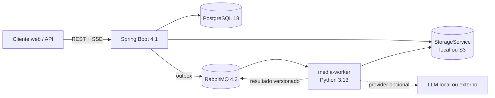

# Arquitetura do Clipador

## Visão final

O Clipador começa com dois processos de aplicação e três dependências operacionais. O backend Java é a autoridade para identidade, regras, estado, ranking final e persistência. O worker Python executa capacidades especializadas de mídia e devolve artefatos e medições; ele não decide sozinho o estado do produto.

## Limites de responsabilidade

### Backend Spring Boot

- API `/api/v1`, autenticação e autorização;
- entidades, transações, state machine e histórico de eventos;
- políticas de limites, seleção, deduplicação e ranking;
- abstração `StorageService` e validação do contrato estruturado de análise;
- publicação confiável via transactional outbox e consumo idempotente;
- consulta, retry, cancelamento, progresso e entrega de resultados.
- aquisição assíncrona via adapter `yt-dlp`, inspeção `ffprobe` e storage do original.

### Media worker

- normalização e corte com FFmpeg;
- transcrição local com faster-whisper + VAD;
- `ClipAnalysisProvider`, features de áudio e variação visual; rostos/ROI entram no reenquadramento;
- legendas SRT/VTT/ASS, thumbnails, smart reframing e render;
- comandos formados a partir de estruturas tipadas, nunca de fragmentos shell enviados pelo usuário.

### Persistência

- PostgreSQL: metadados, estado e resultados estruturados;
- object storage: vídeos, áudios, transcrições grandes, legendas, thumbnails e renders;
- RabbitMQ: comandos e resultados transitórios; não é fonte de verdade.

## Tecnologias concretas

| Área | Escolha | Motivo |
|---|---|---|
| Backend | Java 25 LTS, Spring Boot 4.1.1, Maven 3.9+ | Stack requerida, compatível e com suporte oficial |
| Persistência | PostgreSQL 18, Hibernate 7.4, Flyway | constraints e comportamento real de produção |
| Mensageria | RabbitMQ 4.3, Spring AMQP 4 | roteamento, ack, retry e DLQ sem complexidade de Kafka |
| API | Spring MVC, Validation, ProblemDetail, springdoc 3.0.3 | REST síncrono leve; OpenAPI testável |
| Observabilidade | Actuator, Micrometer, Prometheus, JSON logs | padrão operacional simples e exportável |
| Worker | Python 3.12/3.13, FastAPI 0.141, Pydantic 2.13, Pika 1.4 | contratos estritos, health HTTP e consumo RabbitMQ bloqueante confiável |
| Transcrição | faster-whisper 1.2.1/CTranslate2, Silero VAD | CPU `int8`, idioma automático e timestamps por palavra |
| Aquisição | yt-dlp 2026.08.19, ffprobe | adapter isolado, argumentos fixos e execução assíncrona |
| Mídia | FFmpeg/ffprobe local e OpenCV headless 4.14 | encode robusto e visão local sem GUI ou API externa |
| Testes | JUnit 5, AssertJ, Mockito, Testcontainers 2.0.5, pytest | banco real e testes determinísticos |

Python 3.12 ou 3.13 evita incompatibilidades prematuras de wheels de ML. O frontend, na Fase 9, será React + TypeScript + Vite, mantido como SPA fina consumindo a API.

## Módulos internos do backend

O backend é um monólito modular, organizado por capacidade (`video`, `job`, `transcript`, `clip`, `event`, `identity`). Não há camadas horizontais artificiais. Dependências externas entram por adapters apenas quando existe uma razão real de substituição: storage, aquisição de vídeo e providers de IA.

## Confiabilidade do pipeline

1. A API grava mudança de estado, `ProcessingEvent` e mensagem de outbox na mesma transação.
2. O relay publica a mensagem persistida com `messageId`, `jobId`, `taskType`, `attempt` e versão do schema; falhas do relay usam backoff exponencial limitado.
3. RabbitMQ entrega em quorum queues com publisher confirms, manual ack, retry por fila TTL e DLQ.
4. O worker consulta sua inbox SQLite persistente, valida o artefato e guarda o resultado antes de confirmar o comando.
5. O resultado retorna por fila. O backend faz um `INSERT ... ON CONFLICT DO NOTHING` na inbox PostgreSQL, valida o job e persiste o efeito na mesma transação.
6. Falhas transitórias passam por retry limitado; mensagens inválidas ou esgotadas vão para DLQ.
7. Renderizações são controladas por clipe, permitindo resultado parcial sem invalidar os demais.

Locks pessimistas serializam comandos de usuário concorrentes; `@Version` detecta alterações concorrentes fora desse caminho. A unicidade de `idempotency_key` impede cadastro duplicado.

Os comandos `VALIDATE_MEDIA`, `EXTRACT_AUDIO`, `TRANSCRIBE_AUDIO`, `ANALYZE_CONTENT` e `RENDER_CLIPS` têm contratos próprios versionados e filas independentes. `RENDER_CLIPS` v1 continua aceito para redeliveries antigos e usa fundo desfocado; v2 carrega a política limitada de smart reframing. Artefatos intermediários ficam em `jobs/{jobId}/`, usam escrita atômica e são referenciados no job; resultados grandes nunca trafegam pelo RabbitMQ. `CLIPADOR_WORKER_TASKS` permite especializar processos sem criar outro serviço.

## Segurança

O MVP usa HTTP Basic stateless apenas para desenvolvimento e ambientes privados, sempre atrás de TLS. A migração planejada é OAuth2 Resource Server/JWT, preservando os endpoints. URLs YouTube passam por allowlist estrita de esquema, host, porta e formato, bloqueando hosts privados e lookalikes antes do adapter. Uploads são inspecionados pelo conteúdo e por `ffprobe`; caminhos são gerados pelo servidor. Processos externos recebem arrays de argumentos com valores validados, sem shell.
