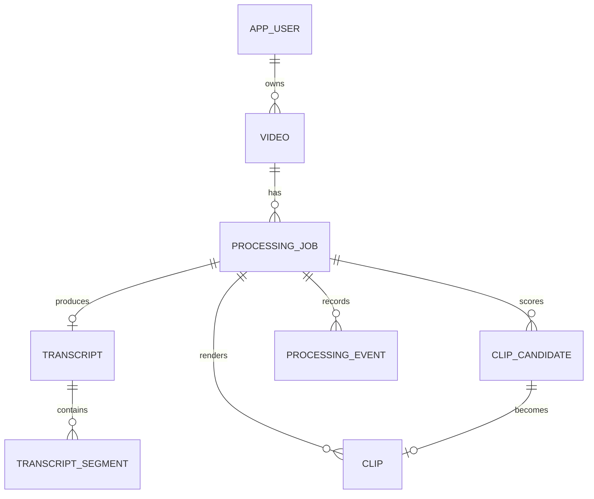

# Modelo inicial de dados

Entidades de domínio usam UUID, `version`, `created_at` e `updated_at`; tabelas técnicas de mensageria usam UUID e timestamps próprios, sempre em UTC. Os tempos dentro do conteúdo usam `numeric(12,3)`, evitando erro acumulado de ponto flutuante. Scores usam `numeric(6,5)` e constraints entre 0 e 1.

## Tabelas

- `app_user`: identidade persistível para a evolução de Basic para JWT/OAuth2.
- `video`: origem e metadados; guarda somente o caminho do objeto, nunca o binário.
- `processing_job`: estado atual, progresso, correlação, idempotência, tentativas e caminhos de áudio, transcrição e análise intermediários. Também persiste `clip_quantity_mode`, a quantidade manual solicitada e a meta efetivamente calculada para tornar retries reproduzíveis e auditáveis.
- `transcript` e `transcript_segment`: cabeçalho e segmentos ordenados; palavras ficam em JSONB quando disponíveis.
- `clip_candidate`: janela temporal, chave estável, texto-base e sinais individuais que explicam o ranking e a seleção.
- `clip`: uma saída por candidato e formato, com caminhos MP4/SRT/VTT/ASS/thumbnail; `render_error` permite falha parcial sem `storage_path`.
- `processing_event`: trilha append-only das transições.
- `outbox_message`: publicação confiável para RabbitMQ, com tentativas e próximo instante de retry.
- `inbox_message`: deduplicação transacional de resultados recebidos do worker.

Índices cobrem listagem temporal, polling de jobs por estado, segmentos por tempo, candidatos por score, clipes por job, eventos por job e mensagens ainda não publicadas.
