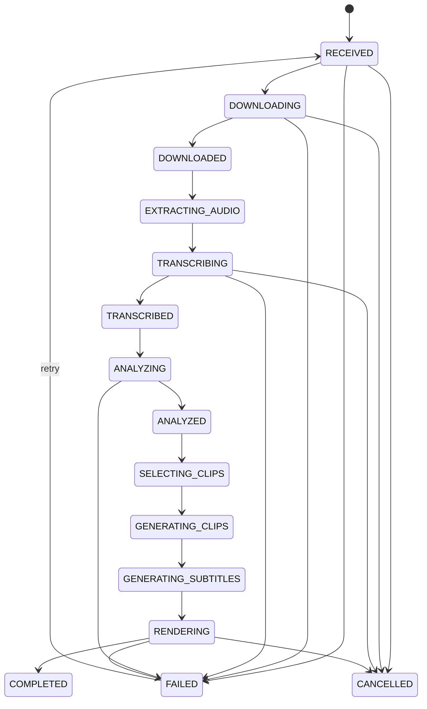

# Pipeline completo



## Etapas e artefatos

1. **Recepção:** valida autorização declarada, limites, idempotência e origem.
2. **Aquisição:** upload incremental ou adapter `yt-dlp` assíncrono; `ffprobe` confirma o conteúdo real, container, codecs, duração e dimensões antes de `DOWNLOADED`.
3. **Gate assíncrono:** `VALIDATE_MEDIA` verifica namespace, confinamento, tipo, tamanho e leitura; o backend então persiste `EXTRACTING_AUDIO` e publica o próximo comando na mesma transação.
4. **Normalização:** `EXTRACT_AUDIO` gera WAV PCM signed 16-bit, mono, 16 kHz por arquivo temporário e rename atômico, sem carregar vídeo em memória.
5. **Transcrição:** `TRANSCRIBE_AUDIO` usa faster-whisper 1.2.1, Silero VAD, idioma automático ou hint `pt`/`en` e timestamps por palavra. O JSON intermediário é limitado e o backend persiste segmentos em lotes antes de `TRANSCRIBED`.
6. **Features multimodais:** o WAV é lido incrementalmente em janelas de 500 ms para energia/silêncio; o FFmpeg amostra quadros 64×36 a 1 FPS para variação visual.
7. **Candidatos semânticos:** `ClipAnalysisProvider` local retorna artefato JSON versionado com janelas, hook, título publicável, razão, categoria, completude e dependência de contexto. O modo local extrai a frase mais forte da própria transcrição; com Ollama, o título é produzido por saída estruturada, com instruções para ser curto, fiel e não enganoso.
8. **Ajuste de fronteiras:** snapping para começo/fim de sentença, silêncio e scene cuts, respeitando 20–90 s.
9. **Score:** combinação configurável de semântica, áudio, visual, narrativa e hook, menos dependência de contexto.
10. **Quantidade e diversidade:** a meta pode ser automática pela duração, ampliada em cerca de 50% ou definida manualmente entre 1 e 30. A seleção greedy no backend para ao atingir essa meta e compara interseção sobre a menor janela e Jaccard dos termos relevantes para eliminar sobreposição e repetição; portanto pode entregar menos que a meta quando faltam opções realmente distintas.
11. **Smart reframing e render:** o contrato `RENDER_CLIPS` v2 pede uma política limitada e reproduzível. OpenCV amostra 0,25–5 FPS, detecta rostos e partes superiores do corpo, agrupa sujeitos quando couberem no frame e usa movimento quando não há pessoa detectável. Retenção temporal, limite de velocidade e reset em mudança brusca suavizam a trajetória. O FFmpeg interpola os keyframes no filtro `crop`, escala para o formato final, recodifica com H.264/AAC, gera SRT/VTT/ASS, karaoke ASS com burn-in opcional e thumbnail. Erro na análise visual degrada para fundo desfocado em vez de perder o clipe.
12. **Publicação:** o manifesto registra cada candidato × formato. O backend valida paths, dimensões, duração e leitura dos artefatos, persiste falhas isoladas e conclui como sucesso total ou parcial observável. A API expõe o título de cada corte e o utiliza, sanitizado, como nome do arquivo MP4 baixado.

Score padrão implementado:

```text
final = normalize(0.30 semantic
                + 0.12 audio_interest
                + 0.08 visual_interest
                + 0.22 narrative_completeness
                + 0.23 hook_quality)
      - 0.15 context_dependency
```

Os pesos seguem no comando versionado do job e podem ser alterados por ambiente. Antes da seleção, cada candidato é limitado a `[0,1]`; o resultado final também é limitado a esse intervalo.
